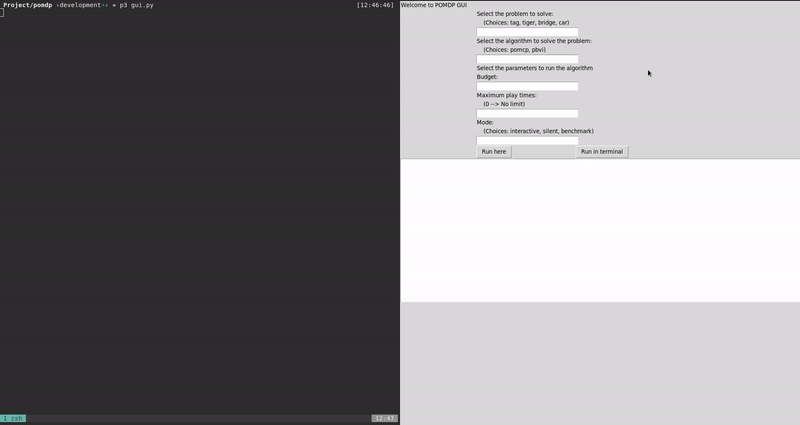
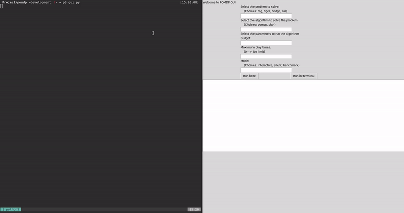
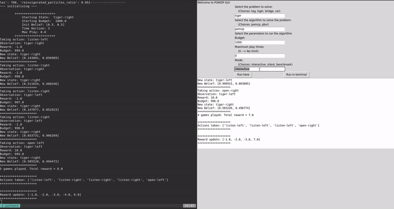

# POMDP

## Implementation and analysis of Partially Observable Markov Decision Processes on Python.

This project is made for educational purposes only in the context of the subject 'Artificial Inteligence' from Software Engineering degree of the University of Seville.

The objective of the project is to study and solve a decision problem by establishing probabilities of taking certain decisions and establishing rewards according to the current situation, the action taken and its final consequence (i.e. a T(s, a, s') transition function).

A POMDP problem is solved by determining the criteria for actions to be taken in such a way as to maximize the final reward.

We use [the PyPOMDP library](https://github.com/namoshizun/PyPOMDP)

More information about POMDP is available in [pomdp.org](http://www.pomdp.org/)

## Source code structure

The implemented source code, besides the mentioned library, is divided in three .py files, which are detailed below in execution order:

* [gui.py](pomdp/gui.py): The graphical interface of the application, made using [TkInter](https://wiki.python.org/moin/TkInter). It provides the option to run the simulation of the available problems in its different execution modes (interactive, silent and benchmark), these execution modes will be detailed later. It offers the possibility of visualizing the execution output both in the interface itself and in the operating system terminal. The calls made by the interface are addressed to the functions available in the app.py file.

* [app.py](pomdp/app.py): Its function is to make calls to the library to read the '.pomdp' files (files where the problems to be solved are defined) and to make calls to the 'runner.py' archive methods that use functions from the library to give a complete solution to the problem. The data needed to call the different run methods designed specifically for each problem are: `env` (.pomdp file to solve), `config` (algorithm to solve the problem: pomcp or pbvi), `budget` (budget to solve the problem, used to assume the cost of the different actions) and `max_play` (maximum number of iterations to perform, 0 to deactivate this limit).

* [runner.py](pomdp/runner.py): It creates the model and the solver (which wraps the algorithm used) and makes the calls to the required library in order to obtain solutions and compute statistics. It contains a method defined for each available problem in all of the three execution modes (interactive, silent and benchmark).

## Demo

### Interactive mode
The simulation is executed showing the iterations step by step.

### Silent mode
The simulation runs to a stop state and the number of steps and cumulative reward is shown.

### Benchmark mode
The silent mode is executed 30 times and at the end statistics are shown, specifically the mean and standard deviation of the steps number and the accumulated reward.

## Performing experiments

It is enough to introduce in the interface, the values that we want for each defined problem and the algorithm to use.

## Replication of performed experiments

The results of each experiment are random in each iteration because of the nature of the problem we are dealing with (problem solving with uncertainty or pomdp). For this reason, it is possible that a final solution may not be reached due to not achieving the stop condition, exceeding the maximum number of iterations or spending the entire budget.

### Experiment \#1
- Select the problem to solve: `tiger`
- Select the algorithm to solve the problem: `pomcp`
- Budget: `100`
- Maximum play times: `0`
- Mode: `interactive`

### Experiment \#2
- Select the problem to solve: `tiger`
- Select the algorithm to solve the problem: `pomcp`
- Budget: `100`
- Maximum play times: `0`
- Mode: `silent`

### Experiment \#3
- Select the problem to solve: `tiger`
- Select the algorithm to solve the problem: `pomcp`
- Budget: `100`
- Maximum play times: `0`
- Mode: `benchmark`

### Experiment \#4
- Select the problem to solve: `tiger`
- Select the algorithm to solve the problem: `pbvi`
- Budget: `100`
- Maximum play times: `0`
- Mode: `interactive`

### Experiment \#5
- Select the problem to solve: `tiger`
- Select the algorithm to solve the problem: `pbvi`
- Budget: `100`
- Maximum play times: `0`
- Mode: `silent`

### Experiment \#6
- Select the problem to solve: `tiger`
- Select the algorithm to solve the problem: `pbvi`
- Budget: `100`
- Maximum play times: `0`
- Mode: `benchmark`

### Experiment \#7
- Select the problem to solve: `tag`
- Select the algorithm to solve the problem: `pomcp`
- Budget: `100`
- Maximum play times: `0`
- Mode: `interactive`

### Experiment \#8
- Select the problem to solve: `tag`
- Select the algorithm to solve the problem: `pomcp`
- Budget: `100`
- Maximum play times: `0`
- Mode: `silent`

### Experiment \#9
- Select the problem to solve: `tag`
- Select the algorithm to solve the problem: `pomcp`
- Budget: `100`
- Maximum play times: `0`
- Mode: `benchmark`

### Experiment \#10
- Select the problem to solve: `tag`
- Select the algorithm to solve the problem: `pbvi`
- Budget: `100`
- Maximum play times: `10`
- Mode: `interactive`

### Experiment \#11
- Select the problem to solve: `tag`
- Select the algorithm to solve the problem: `pbvi`
- Budget: `100`
- Maximum play times: `10`
- Mode: `silent`

### Experiment \#12
- Select the problem to solve: `tag`
- Select the algorithm to solve the problem: `pbvi`
- Budget: `100`
- Maximum play times: `0`
- Mode: `benchmark`

### Experiment \#13
- Select the problem to solve: `bridge`
- Select the algorithm to solve the problem: `pomcp`
- Budget: `100`
- Maximum play times: `0`
- Mode: `interactive`

### Experiment \#14
- Select the problem to solve: `bridge`
- Select the algorithm to solve the problem: `pomcp`
- Budget: `100`
- Maximum play times: `0`
- Mode: `silent`

### Experiment \#15
- Select the problem to solve: `bridge`
- Select the algorithm to solve the problem: `pomcp`
- Budget: `100`
- Maximum play times: `0`
- Mode: `benchmark`

### Experiment \#16
- Select the problem to solve: `bridge`
- Select the algorithm to solve the problem: `pbvi`
- Budget: `100`
- Maximum play times: `10`
- Mode: `interactive`

### Experiment \#17
- Select the problem to solve: `bridge`
- Select the algorithm to solve the problem: `pbvi`
- Budget: `100`
- Maximum play times: `10`
- Mode: `silent`

### Experiment \#18
- Select the problem to solve: `bridge`
- Select the algorithm to solve the problem: `pbvi`
- Budget: `100`
- Maximum play times: `0`
- Mode: `benchmark`

### Experiment \#19
- Select the problem to solve: `car`
- Select the algorithm to solve the problem: `pomcp`
- Budget: `100`
- Maximum play times: `0`
- Mode: `interactive`

### Experiment \#20
- Select the problem to solve: `car`
- Select the algorithm to solve the problem: `pomcp`
- Budget: `100`
- Maximum play times: `0`
- Mode: `silent`

### Experiment \#21
- Select the problem to solve: `car`
- Select the algorithm to solve the problem: `pomcp`
- Budget: `100`
- Maximum play times: `0`
- Mode: `benchmark`

### Experiment \#22
- Select the problem to solve: `car`
- Select the algorithm to solve the problem: `pbvi`
- Budget: `100`
- Maximum play times: `0`
- Mode: `interactive`

### Experiment \#23
- Select the problem to solve: `car`
- Select the algorithm to solve the problem: `pbvi`
- Budget: `100`
- Maximum play times: `0`
- Mode: `silent`

### Experiment \#24
- Select the problem to solve: `car`
- Select the algorithm to solve the problem: `pbvi`
- Budget: `100`
- Maximum play times: `0`
- Mode: `benchmark`